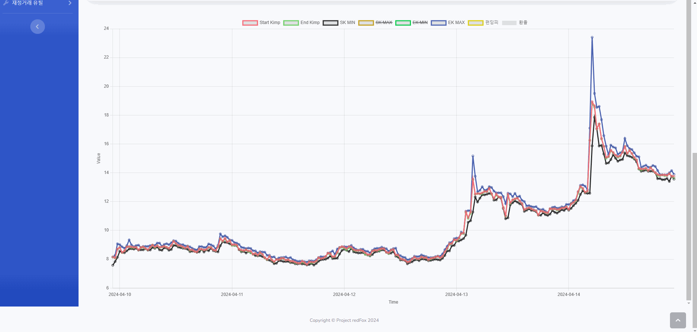
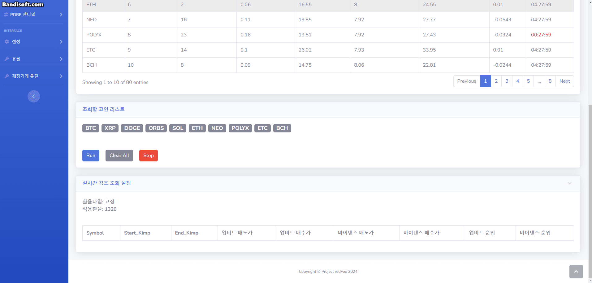
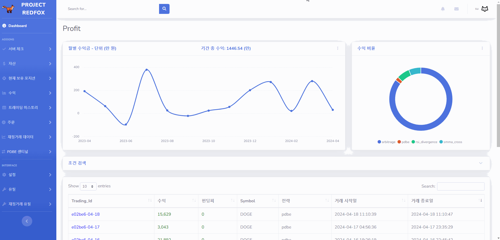
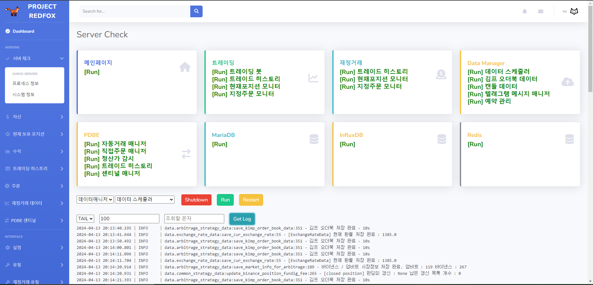
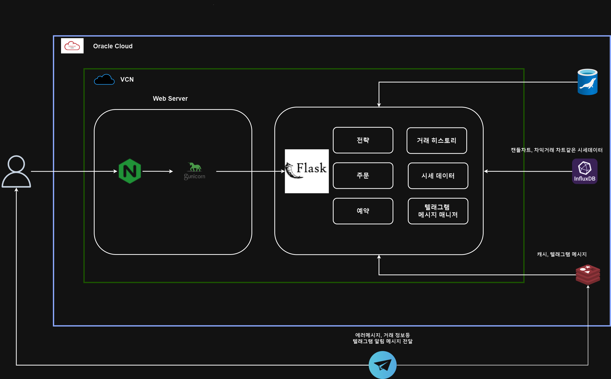

  

<h1 align="center">redFox</h1>
 

redFox는 차익거래를 위한 정보 제공과 거래 자동화, 자산관리를 통합한 코인 프로젝트입니다.

## Contents
  - [특징](#특징)
  - [기능](#기능)
  - [기술스택](#기술스택)
  - [아키텍처](#아키텍처)

 

<table>
    <tr>
        <td align="center">김치프리미엄 차트</td>
    </tr>
    <tr>
        <td align="center">
            
        </td>
    </tr>
    <tr>
        <td align="center">김치프리미엄 실시간 정보</td>
    </tr>
    <tr>
        <td align="center">
            
        </td>
    </tr>
    <tr>
        <td align="center">수익</td>
    </tr>
    <tr>
        <td align="center">
            
        </td>
    </tr>
</table>

## 특징
- 

## 기능

  
서버관리

  

  
  
  

## 기술스택

### Front End

### Back End

### Database

## 아키텍처

   
  
   

