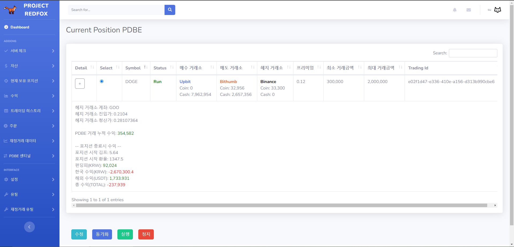

  

<h1 align="center">redFox</h1>
 

redFox는 차익거래를 위한 정보 제공과 거래 자동화, 자산관리를 통합한 코인 프로젝트입니다.
독립적인 5개의 프로젝트로 구성되어 있으며 크게 3부분으로 구분됩니다.

#### 웹 페이지
- 데이터 조회, 자동거래 전략 설정 등 여러 프로세스를 제어 하고 시각화 하기 위해 만든 프로세스입니다
- 전략의 현황을 조회하고 설정을 변경할 수 있습니다. 또한 전략의 실행/정지를 제어 할 수 있습니다
- 거래에 필요한 데이터를 시각화하여 보여줍니다

#### 데이터
- 암호화폐 데이터를 가공하고 저장하여 자동거래에 사용하거나 사용자에게 제공합니다
- 중요한 시스템 메시지나 거래 정보를 사용자에게 텔래그램 메시지로 전송합니다

#### 거래
- 사용자가 설정한 전략과 수집한 데이터에 따라 거래를 자동으로 수행합니다

## Contents
  - [특징](#특징)
  - [기능](#기능)
  - [기술스택](#기술스택)
  - [아키텍처](#아키텍처)

 

<table>
      <tr>
        <td align="center">메인</td>
    </tr>
    <tr>
        <td align="center">
            
        </td>
    </tr>
    <tr>
        <td align="center">김치프리미엄 차트</td>
    </tr>
    <tr>
        <td align="center">
            
        </td>
    </tr>
    <tr>
        <td align="center">김치프리미엄 실시간 정보</td>
    </tr>
    <tr>
        <td align="center">
            
        </td>
    </tr>
    <tr>
        <td align="center">수익</td>
    </tr>
    <tr>
        <td align="center">
            
        </td>
    </tr>
</table>

## 특징
- 웹 페이지로 관리하기 때문에 플렛폼이나 장소의 제약없이 실시간으로 데이터조회와 전략 제어를 할 수 있습니다.
- 웹소켓을 통해 여러 거래소간 가격을 실시간으로 조회하고 비동기 방식을 통한 빠른거래를 지원합니다.
- 슬리피지, 펀딩피등 거래시 발생할 수 있는 숨겨진 비용을 계산하여 거래가 가능하도록 구성되었습니다.

## 기능

  
서버관리

 

- 시스템의 메모리, 하드용량, cpu 사용량등을 확인할 수 있습니다
- 실행중인 프로세스를 조회하고 이를 종료하거나 재시작할 수 있습니다
- 각 프로세스의 로그를 조회할 수 있습니다
  

  
  
  

  
자동거래

 

- 업비트, 빗썸, 바이낸스 API를 사용해서 각 전략에 따라 코인을 매수하거나 매도합니다
- 설정된 전략에 따라 각 거래소의 웹소켓을 연결하여 실시간으로 시세를 추적하고 조건에 맞으면 거래를 체결합니다
- 주문이 체결되면 거래 히스토리에 데이터를 저장하고 수익을 자동으로 계산하여 저장합니다

  
자산조회

 

- 거래소에 보유중인 코인의 현재가치와 현금을 조회합니다
- 자산의 변화를 일별, 월별 차트로 제공합니다
  
  

  

  
포지션

 

- 현재 실행중인 자동거래 포지션의 데이터와 상태를 조회합니다
- 포지션을 종료하거나 일시정지 할 수 있습니다
- 자동으로 거래할 가격, 종료시점등 다양한 설정을 할 수 있습니다
- 포지션의 실시간 수익을 조회할 수 있습니다
  

  
  

  
수익

 

- 월별 수익금 변화와 전략별 수익비율을 차트로 조회할 수 있습니다
- 전략별 거래일자와 수익금을 조회할 수 있습니다
- 차익거래의 KRW/USDT 수익 통계를 월별, 일별로 조회할 수 있습니다
  

  
  

  
히스토리

 

- 전략별 거래 히스토리 정보를 조회할 수 있습니다
  

  

  
주문

 

- 자동거래 포지션을 시작하거나 종료합니다
- 주문이 완료되면 히스토리와 보유 포지션에 등록됩니다
- 특정시간에 주문이 실행되는 예약주문기능을 사용할수 있습니다
  

  
  
  

  
차익거래 데이터

 

- 거래소간의 가격차이, 김치프리미엄의 변화를 차트로 시각화 하여 제공합니다
- 차트의 검색기간과 그래프의 간격을 조정할 수 있습니다
- 펀딩피와 펀딩피 지급시간을 실시간으로 조회할 수 있습니다
  

  
  

  
텔래그램 알림 메시지

 

- 모든 거래정보는 텔래그램 메시지로 사용자에게 전달됩니다
- 서버의 주요 에러정보가 관리자에게 전달됩니다
  

## 기술스택

### Front End

### Back End

### Database

## 아키텍처

   
  
   

